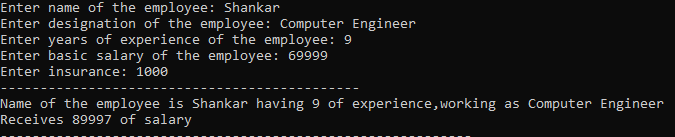

# Ex.No:4 Constructor
## Aim:
To write a C# program to calculate the salary of an employee by passing the name, designation, noofexperience, basic salary and insurance amount through constructor.

## Algorithm:
### Step 1:
Create a new Class named emp_sal.
### Step 2:
Create a constructor
### Step 3:
Create two methods one is Salary & other is Display
### Step 4:
Create a main function and get name, designation, experience, basic salary and insurance amount from the User.
### Step 5:
Create a object and pass the input as parameters
### Step 6:
Call the salary method to calculate the salary
### Step 7:
Call the display method to display the details
### Step 8:
End of the Program.

## Program:
Developed By: **SRIJITH R**
</br>
Register No: **212221240054**
</br>
```C#
using System;
namespace exp4
{
    public class emp_sal
    {
        string name, desg;
        int exp, bs, ins, hra = 0, ta = 0, sal = 0;
        
        public emp_sal(string name,string desg,int exp,int bs,int ins)
        {
            this.name = name;
            this.desg = desg;
            this.exp = exp;
            this.bs = bs;
            this.ins = ins;
            
            salary(bs, ins);
            display(name,desg,exp,sal);
        }
        void salary(int bs,int ins)
        {
            this.hra = (20 * bs) / 100;
            this.ta = (10 * bs) / 100;
            
            sal = hra + ta + bs - ins;
        }
        
        void display(string name, string desg, int exp, int sal)
        {
            Console.Write("Name of the employee is {0} ",name);
            Console.WriteLine("having {0} of experience,working as {1}",exp,desg);
            Console.WriteLine("Receives {0} of salary",sal);
            
            Console.WriteLine("-----------------------------------------------------------");
        }
    }
    public class prgm
    {
        static void Main(String[] args)
        {
            string nam, desig;
            int exp, bs, ins, n;
            
            Console.Write("Enter no of employees: ");
            n = Convert.ToInt32(Console.ReadLine());
            
            for (int i = 1; i <= n; i++)
            {
                Console.Write("Enter name of the employee: ");
                nam = Console.ReadLine();
                Console.Write("Enter designation of the employee: ");
                desig = Console.ReadLine();
                Console.Write("Enter years of experience of the employee: ");
                exp = Convert.ToInt32(Console.ReadLine());
                Console.Write("Enter basic salary of the employee: ");
                bs = Convert.ToInt32(Console.ReadLine());
                Console.Write("Enter insurance: ");
                ins = Convert.ToInt32(Console.ReadLine());
                Console.WriteLine("---------------------------------------------");
                emp_sal emp = new emp_sal(nam, desig, exp, bs, ins);
            }
        }
    }
}
 ```
 ## Output:
   
 
 ## Result:
 Hence, a C# program to calculate the salary of an employee by passing the name, designation, noofexperience, basic salary and insurance amount through constructor is executed successfully
